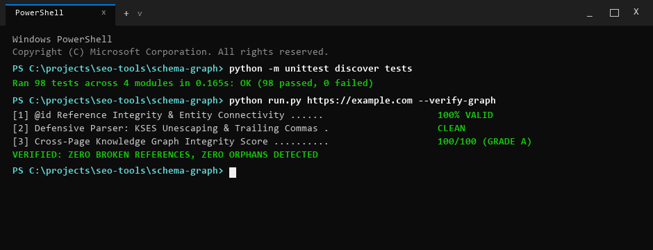

# SchemaGraph

Cross-page entity and knowledge graph integrity tracer for Schema.org JSON-LD.

Part of the [WebAudits.pro](https://webaudits.pro) technical intelligence platform.



---

## Quickstart

Install in editable mode and audit any multi-page site or sitemap in seconds:

```bash
# Clone and install
git clone https://github.com/xcalibur73/schema-graph.git
cd schema-graph
pip install -r requirements.txt
pip install -e .

# Audit target URLs
schema-graph https://example.com https://example.com/about

# Crawl and audit via sitemap
schema-graph https://example.com/sitemap.xml --sitemap --max-urls 25
```

---

## What It Does & Why It Matters

SchemaGraph extracts, connects, and audits structured data entities across multi-page website clusters. It builds an in-memory directed knowledge graph from `<script type="application/ld+json">` blocks to detect cross-page entity inconsistencies that may reduce structured-data clarity or search feature eligibility.

While Google's documentation confirms that structured data helps search engines understand content and can enable eligibility for supported search features, modern CMS plugins frequently emit JSON-LD blocks on an isolated, per-page basis. This leads to fragmented entity graphs where pages reference author or publisher `@id` nodes that are never defined within the crawl scope.

SchemaGraph audits the entire domain graph as a single connected data structure to detect:
- **Broken `@id` References:** Entities referencing target URIs that are never defined anywhere on the domain.
- **Orphan Entity Nodes:** Declared schema objects that have no incoming or outgoing relationship edges.
- **Circular Dependency Chains:** Recursive reference loops detected via depth-first search (DFS).
- **Publisher & Author Consistency:** Attribute drift across templates (differing names, logos, or URLs for the same entity).
- **Disambiguation Coverage:** Presence of verified `sameAs` links to Wikidata, Wikipedia, or authority profiles on key entities (`Organization`, `Person`).

---

## Visual Diagnostic Workflow

```text
[Input URLs or Sitemap]
          |
          v
[1. Extract JSON-LD Blocks] --------> Found: 48 entities across 12 pages
          |
          v
[2. Build Directed Knowledge Graph] -> Finding: Article node references author @id "https://example.com/#author-jane"
          |                            Status: Target URI is NOT defined in any crawled document
          v
[3. Isolate Graph Root Cause] -------> Diagnosis: Author schema only emitted on /author/jane page, not on post templates
          |
          v
[4. Recommended Fix] ----------------> Inject minimal Author node or consolidate @id URIs to preserve entity graph clarity
```

---

## Usage & CLI Options

```bash
# Audit specific URLs
schema-graph https://webaudits.pro https://webaudits.pro/about

# Crawl up to 50 URLs discovered in an XML sitemap
schema-graph https://webaudits.pro/sitemap.xml --sitemap --max-urls 50

# Export as GraphViz DOT file for visual architecture inspection
schema-graph https://webaudits.pro/sitemap.xml --sitemap --output dot --save graph.dot

# Export machine-readable JSON report for CI/CD gates
schema-graph https://webaudits.pro --output json --save schema-audit.json

# Check installed version
schema-graph --version
```

---

## Example Output

```text
+-------------------------------------------------------------------------------+
| SchemaGraph: Cross-Page Entity & Knowledge Graph Integrity Tracer             |
| Crawled URLs: 12                                                              |
| Graph Integrity Score: 94.5/100 (Grade: A)                                    |
| Entities: 48 | Edges: 52 | Broken Refs: 0 | Orphans: 2 | Cycles: 0            |
+-------------------------------------------------------------------------------+

Component Score Breakdown:
+------------------------+--------+------------+
| Component Dimension    | Weight | Score      |
+------------------------+--------+------------+
| Reference Integrity    | 35%    | 100.0/100  |
| Entity Connectivity    | 25%    | 95.8/100   |
| Disambiguation Depth   | 20%    | 88.0/100   |
| Publisher Consistency  | 10%    | 100.0/100  |
| Author Consistency     | 10%    | 100.0/100  |
+------------------------+--------+------------+

Disambiguation Depth Audit:
- Organization (webaudits.pro): 7 verified sameAs links (Wikidata, Twitter, GitHub)
- Person (@xcalibur73): Verified profile links present
```

---

## Architecture

```text
[URL List or Sitemap]
         |
         v
[JSON-LD Extractor] ----------> Raw Blocks & Normalized @id URIs
         |
         v
[Entity Graph Builder] -------> In-Memory Directed Graph
         |
         +---> Broken @id Reference Resolver
         +---> Orphan Node Identifier
         +---> DFS Circular Dependency Detector
         +---> Publisher & Author Consistency Checker
         +---> Disambiguation Coverage Auditor
         |
         v
[Scoring Engine] -------------> 5-Component Composite Graph Integrity Score
         |
         +---> Terminal Report (Rich Table)
         +---> Markdown Document / JSON Object / GraphViz DOT Export
```

- `extractor.py`: Fetches HTML, parses XML sitemaps, extracts JSON-LD blocks, normalizes URI formats, and flattens entities into uniform records.
- `graph_builder.py`: Constructs graph nodes and directed edges based on reference properties (`author`, `publisher`, `isPartOf`, `mainEntityOfPage`, `about`), running DFS cycle detection.
- `scorer.py`: Evaluates graph health across five weighted dimensions (Reference Integrity, Connectivity, Disambiguation, Publisher Consistency, Author Consistency).
- `report_generator.py`: Formats Rich terminal tables, Markdown documentation, JSON objects, and DOT graph files.

---

## Standards & Heuristics

SchemaGraph separates established web standards and official search guidance from project-derived heuristics:

| Metric / Check | Classification | Authority / Basis |
|:---|:---|:---|
| JSON-LD Syntax | Web Standard | W3C JSON-LD 1.1 Specification |
| Schema.org Vocabulary | Web Standard | Schema.org Community Group |
| Connected `@id` Attribution | Search Engine Guidance | Google Search Central Structured Data Guidelines |
| Reference Resolution Integrity | Project-Derived Heuristic | Domain-level graph closure verification |
| Entity Connectivity Score | Project-Derived Heuristic | Structural ratio of connected vs. orphan nodes |
| Disambiguation Depth Score | Project-Derived Heuristic | Presence of recognized third-party authority URIs |
| Graph Integrity Composite | Project-Derived Heuristic | 5-factor weighted structural evaluation model |

> **Confirmed Guidance vs. Graph Heuristics:** Google Search Central confirms that structured data with connected `@id` nodes assists in disambiguating entities (such as authors and organizations). SchemaGraph's graph closure scoring and connectivity ratios are project-derived heuristics that evaluate whether the site's markup forms a clean, unbroken relational graph.

---

## Limitations

- **Structural Heuristic vs. Google Index:** Graph integrity scoring measures internal consistency; it cannot verify Google's internal entity reconciliation state or guarantee rich snippet appearance.
- **JSON-LD Only:** Audits `<script type="application/ld+json">` elements; inline HTML5 Microdata and RDFa attributes are not extracted.
- **Syntax Validation vs. External Scraping:** Validates the presence and format of external `sameAs` URIs (e.g. Wikidata IDs); it does not crawl external third-party servers to verify external content alignment.

---

## Testing & CI

```bash
# Run unit test suite
python -m unittest discover -s tests

# Output
# Ran 95 tests in 0.055s
# OK
```

Automated CI workflows test graph construction, cycle detection, and extraction across Ubuntu and Windows runners on every commit.

---

## License

MIT License. See [LICENSE](LICENSE) for details.
